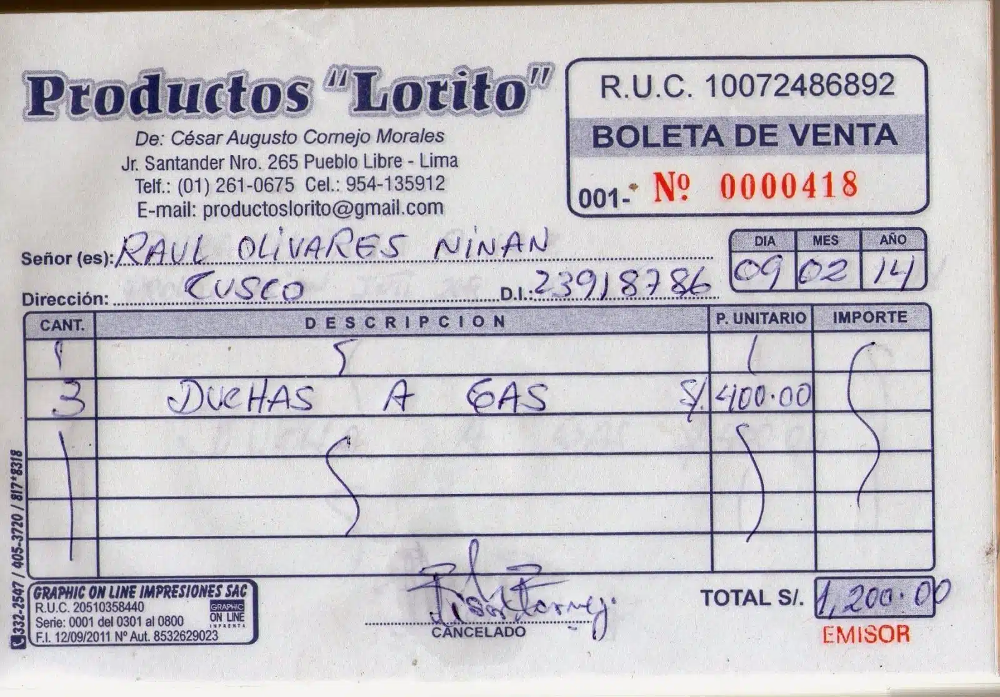
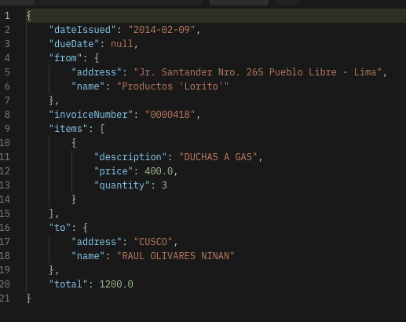

[back](/README.md#foo)

## Contents
[OCR Model Testing](#ocr-model-testing-robothammer_and_wrench)<br>
- [Overview](#mag-overview)<br>
- [Step-by-Step Testing Guide](#hammer_and_wrench-step-by-step-testing-guide)<br>
  - [Step 1: Select the Image](#step-1-select-the-image-page_facing_up)<br>
  - [Step 2: Retrieve OCR Response](#step-2-retrieve-ocr-response-outbox_tray)<br>
  - [Step 3: Update the Configuration](#step-3-update-the-configuration-arrows_counterclockwise)<br>
  - [Step 4: Support](#step-4-support-sos)<br>
- [Tests Conducted](#white_check_mark-tests-conducted)<br>
<!-- - [Conclusion](#checkered_flag-conclusion)<br> --> 


# OCR Model Testing :robot::hammer_and_wrench:

## :mag: Overview

This guide facilitates testing the OCR Model Application, demonstrating its capability to extract text from uploaded images and return processed data.

### Endpoints included in this project:

- **POST /ocr_model:** Retrieves OCR response from the processed image.


## :hammer_and_wrench: Step-by-Step Testing Guide

### Step 1: Select the Image :page_facing_up:

Select an image that the OCR Model will process to extract text:

- **Endpoint:** `POST http://localhost:8080/ocr_model`
- **Content-Type:** `multipart/form-data`
- **Body:**

``` json
{
    "image": "invoice_lorito.webp"
}
```
> [!NOTE]
> Replace this with you image.

### Step 2: Retrieve OCR Response :outbox_tray:

Retrieve the OCR text results from the selected image.

**`Execute the POST request to retrieve OCR response.`**

### Step 3: Update the Configuration :arrows_counterclockwise:

Update the parameters configuration json if your application is hosted on a different server or uses different environmental settings.

### Step 5: Support :sos:

For assistance, feel free to open an issue or contact [author](https://github.com/jairzinhosantos).

## :white_check_mark: Tests Conducted
The following tests were carried out to verify text extraction from invoice image.

1. `Invoice Image`
<p align='center' alt='image | invoice_lorito'>
    </a>
    <sub>Figure 1</sub><br>
</p>
<p align='center' alt='image | ocr_response_invoice_lorito'>
    </a><br>
    <sub>Figure 2</sub>
</p>


<!-- ## :checkered_flag: Conclusion --> 
